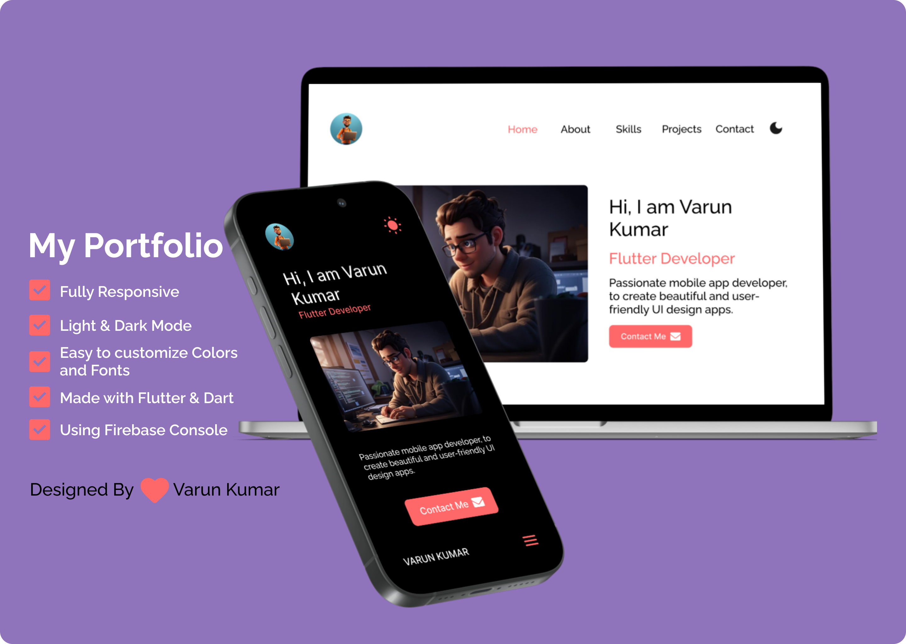

<h1 align="center" style="color:#FFFFFF;font-weight:700;font-family: system-ui, -apple-system, BlinkMacSystemFont, 'Segoe UI', Roboto, Oxygen, Ubuntu, Cantarell, 'Open Sans', 'Helvetica Neue', sans-serif;">My Portfolio</h1>

<h3 style="color:#FFFFFF;font-weight:700;font-family: system-ui, -apple-system, BlinkMacSystemFont, 'Segoe UI', Roboto, Oxygen, Ubuntu, Cantarell, 'Open Sans', 'Helvetica Neue', sans-serif;">Hello folks! </h3>

This is my personal <a href="https://myportfolio-a3703.web.app/">My Portfolio</a>, which has some features of my github projects as well as my resume and technical skills.

## Mockup Template

 

## Getting Started

Clone this repository. Before that, You will need [`Flutter & Dart`](https://docs.flutter.dev/get-started/install) and [`git`](https://git-scm.com/) installed globally on your machine.

A few resources to get you started if this is your first Flutter project:

- [Lab: Write your first Flutter app](https://docs.flutter.dev/get-started/codelab)
- [Cookbook: Useful Flutter samples](https://docs.flutter.dev/cookbook)

For help getting started with Flutter development, view the
[online documentation](https://docs.flutter.dev/), which offers tutorials,
samples, guidance on mobile development, and a full API reference.

## 🛠 Installation and Setup Instructions

1. Installation: `Vs Code` and `Flutter SDK`.

2. Add Firebase account details in `firebase_option.dart` file.

3. In the project directory, you can run the command in terminal: `flutter clean` and `dart pub get`.

4. Once all dependencies are fetched, you can run the command in terminal: `flutter run -d chrome`

Runs the app in the development mode.\
Open [localhost](http://localhost:3000) to view it in the browser. The page will reload if you make edits.

<h3>🔹<a href="https://github.com/SVarunKumarDev/my_portfolio/issues">Report Bug Or Request Feature</a></h3>

## Usage Instructions

Open the project folder and Navigate to `/lib/components/`.  
You will find all the components used and you can edit your information accordingly.

## Show your support

Give a ⭐ if you like this portfolio website!

<a href="https://github.com/SVarunKumarDev/my_portfolio"></img></a>